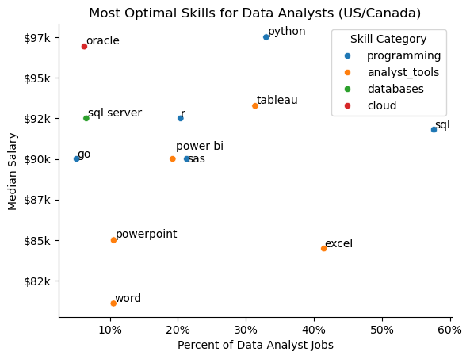

# Overview
This analysis covers several aspects of the current data job market with a focus on data analyst roles. The project was created with a desire to delve into the data job market and understand it effectively in order to optimize success in the industry. This report covers top data job titles, essential skills, salary, and other aspects of the job market.

This project was completed in conjuction with [Luke Barousse's Python for Data Analytics Course](https://lukeb.co/python), which provided all the data analyzed as well as a foundation for my analysis. The dataset used in this analysis was a series of data job postings in 2023 with detailed information on salaries, locations, and essential skills.

For the purpose of the analysis, job postings were filtered to results from the US and Canada. More detailed filters can be found in each notebook.

# Essential Questions
Below are the overarching questions answered through this project's analysis:

1. What are the most demanded skills for popular data roles?
2. How did the top skills for Data Analysts trend over 2023?
3. How well do different data roles pay?
4. How well do different data analyst skills pay?
5. What are the most optimal (high-paying and high-demand) skills for data analysts?

# Tools Used
Through this project, several tools and libraries were utilized in order to analyze more efficiently and generate visualizations:
- **Python**: Allowed for basic analysis and was the backbone of the project
- **Pandas Library**: For data analysis
- **Matplotlib Library**: For data visualization
- **Seaborn Library**: For advanced data visuals
- **Jupyter Notebooks**: Used to run Python Scripts and create analyses
- **Visual Studio Code**: Used to execute Python scripts
- **Github**: Used for version control and to share the analysis publicly

# Analysis
## What are the most demanded skills for popular data roles?
An investigation was conducted into the most demanded skills for certain popular data roles: data analyst, data scientist, data engineer, and business analyst. First, the top 5 skills for each of these roles were determined. Then, they were visualized based on their frequency to highlight which skills should be targeted by candidates applying for these roles.

View my notebook with all steps here: 
[Skills_Count.ipynb](Final_Project/Skills_Count.ipynb)

### Generating Visualization
```python
fig, ax = plt.subplots(len(job_titles), 1,figsize=(6,8))
for i, job_title in enumerate(job_titles):
    df_plot_2 = df_merged[df_merged['job_title_short']==job_title].head(5)
    sns.barplot(data=df_plot_2,x='skill_perc',y='job_skills',ax=ax[i],hue='skill_perc',palette='rocket_r')
plt.show()
```
### Result

*Bar graphs visualizing the popularity of the most demanded skills for top data roles.*

### Insights
- Python is heavily demanded in technical roles like data scientist and data engineer and drops off in lower-level jobs like data analyst and business analyst.
- SQL is the most consistent skill as it is the most demanded skill in every job except data scientist, where it is second to Python.
- Excel and Tableau, data analysis and management tools, are more common among data/business analysts, whereas more specialized tools like AWS and Azure are reserved for data engineers.

## How did the top skills for Data Analysts trend over 2023?
Next, skills for data analysts specifically were analyzed. First, the total postings for each different skill were determined and the top 6 skills were obtained. Next, the percent likelihood of those skills appearing was calculated. Finally, the top 6 data analyst skills were graphed based on month to demonstrate how their demand fluctuated in 2023.

View my notebook with all steps here: 
[Skills_Trend.ipynb](Final_Project/Skills_Trend.ipynb)

### Generating Visualization
```python
fig, ax = plt.subplots()
sns.lineplot(data=my_df_percent.iloc[:,:6])
for i, skill in enumerate(my_df_percent.columns[0:7]):
    ax.plot(my_df_percent.index, my_df_percent[skill], label=skill)
    x_pos = 11
    y_pos = my_df_percent[skill].iloc[-1]
    ax.text(x_pos + 0.2, y_pos, skill, fontsize=10, va='center')
```
### Result

*Line graph demonstrating the 2023 monthly trend of popular data job skills.*

### Insights
- Although SQL is by far the most in-demand skill for data analysts, it is also on a downward trend as it decreased about 5% in 2023.
- Excel, the second most likely skill to appear, also experienced a downward trend towards the second half of the year.
- Less common skills like SAS, Power BI and R demonstrated a relatively steady trend throughout the year.

## How well do different data roles pay?
Next, the expected salaries for the most popular data roles were examined. First, the data was filtered by the top 6 most popular data roles (and business analyst for comparison). Then, salary distributions were calculated and plotted to demonstrate the expected range for these job roles, informing those unsure of which data role to apply for. 

View my notebook with all steps here: 
[Salary_Analysis.ipynb](Final_Project/Salary_Analysis.ipynb)

### Generating Visualization
```python
job_order = my_df_filtered.groupby('job_title_short')['salary_year_avg'].median().sort_values(ascending=False).index
sns.boxplot(data=my_df_filtered,x='salary_year_avg',y='job_title_short',order=job_order)
```

### Result

*Box plot visualizing the salary distributions for top data job titles.*

### Insights
- Senior data roles make significantly more than their lower-level counterparts. However, senior data analysts still make less money than data scientists or engineers despite being a senior role.
- Data scientists have a large IQR and therefore a larger salary range compared to roles like data analyst. 
- Business analysts make the least out of all 7 roles, having a $90k median salary.
- All the roles have many salary outliers on the positive side, demonstrating the consistent reach of more specialized, higher-paying data jobs.

## How well do different data analyst skills pay?
Next, the expected salaries for the most used data analyst skills were determined. First, data was collected for the highest paying data analyst skills as well as the most commonly demanded skills. Then, median salaries were calculated and plotted to demonstrate the monetary appeal of each skill working as a data analyst.

View my notebook with all steps here: 
[Salary_Analysis.ipynb](Final_Project/Salary_Analysis.ipynb)

 ### Generating Visualization
 ```python
sns.barplot(data=my_df_2_top_pay,x='median',y=my_df_2_top_pay.index,ax=ax[0],legend=False,hue='median',palette='rocket_r')
sns.barplot(data=my_df_2_skills,x='median',y=my_df_2_skills.index,ax=ax[1],legend=False,hue='median',palette='rocket_r')
plt.show()
 ```

### Result

*Bar graph showing highest paid and most popular data analyst skills by salary.*

### Insights
- Out of the top 10 most commonnly demanded skills for data analysts, Python is the highest paying, showing not only its prevalence in the workforce but also its higher salary.
- Several Microsoft products such as Powerpoint, Excel and Word are some of the most demanded skills for Data Analysts but they are often not the highest paying, as they require less expertise than other more technical applications.
- It is important to note that the highest paid skills provided on the graph appear in significantly less job postings than the average skill, demonstrating that more specialized technical skills will result in a higher pay. Data analysts should diversify their skillset in order to appeal to a wide range of jobs.

## What are the most optimal skills for data analysts?
For the last analysis, the most optimal skills (based on commonality and salary) for data analysts were determined. First, the most high demand skills and their respective median salaries were determined. Next, their corresponding skill type was determined. All skills included were then graphed on a scatter plot to demonstrate the skills that are most important for aspiring data analysts to master.

View my notebook with all steps here: 
[Optimal_Skills.ipynb](Final_Project/Optimal_Skills.ipynb)

### Generating Visualization
```python
my_df_high_demand = my_df_skills[my_df_skills['skill_percent']>skill_percent]
sns.scatterplot(data=my_df_plot,x='skill_percent',y='median_salary',hue='technology')
for i, txt in enumerate(my_df_high_demand.index):
    texts.append(plt.text(my_df_high_demand['skill_percent'].iloc[i],my_df_high_demand['median_salary'].iloc[i],txt))
plt.show()
```

 ### Result
 

 ### Insights
 - Python and SQL stand out as the most optimal skills for data analysts; Python averages a higher salary while SQL is more common in job postings.
 - While they are some of the most common data science skills, Powerpoint and Word fall behind compared to the other skills listed as they pay less and are less frequently asked for.
 - Data analysts should put their focus on programming (blue) and analyst (orange) tools as these are the most common and most optimal skills to learn (programming being more highly paid). However, database and cloud skills should not be discarded as they prove helpful in higher data roles.

 # Lessons
Several general insights can be made as a result of this analysis:
- **Skill Demand and Salary Correlation**: Skills that are more specialized or require more training usually lead to higher salaries. Advanced skills such as Python not only pay more but also are widely demanded in the job market.
- **Constant Market Change**: The dynamic nature of the data job market was revealed as skill demand and job postings shifted over 2023. Analyzing which skills are on the rise may give a candidate the upper hand when applying for roles.
- **Optimization of Skills for Data Roles**: Knowing which skills are the most demanded as well as the highest paying is key for data analysts to learn the right tools and maximize their returns. 

# Sources of Error
While this project was a good introduction to data analysis and provided a broad overview of the job market, it should not be considered an full comprehensive summary. Several factors contributed to inconsistencies in the project:
- **Inconsistent and Incorrect Data**: All the job postings analyzed were public data. A good deal of information provided was incorrect or missing altogether.
**Balancing Analysis Depth**: This project focused mainly on the US and Canada, often examining only data analyst roles. For a more broad analysis, more roles or countries should be examined, and for a more specific analysis, a data analyst should consider narrowing down this analysis to a smaller geographical area.

 # Conclusion
This dive into the data job market was an informative exploration into the nuances and trends of modern roles in data science. Based on the insights drawn, those applying to data jobs should always be aware of the skills needed to succeed in certain roles and keep aware of the changing market to stay ahead in data analytics. This project serves as a basic foundation for data analytics and will prove useful in future projects and learning in the field of data.