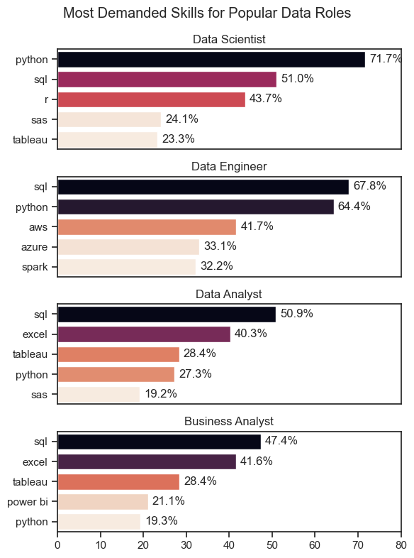
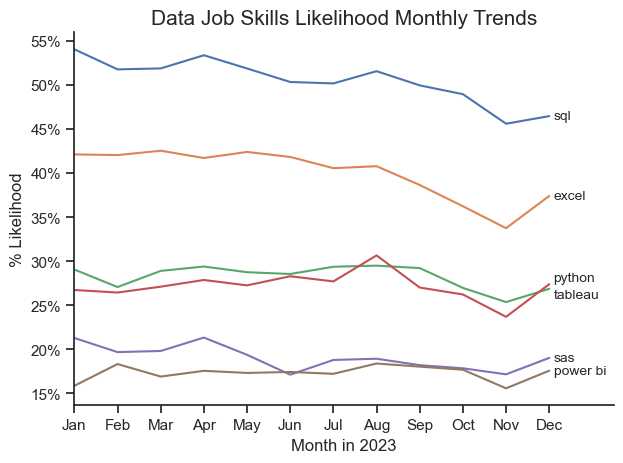
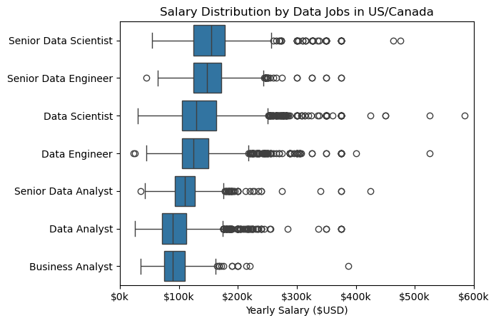
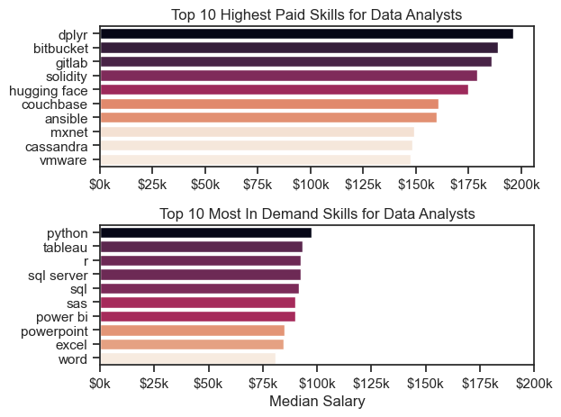

# Analysis
## What are the most demanded skills for popular data roles?
An investigation was conducted into the most demanded skills for certain popular data roles: data analyst, data scientist, data engineer, and business analyst. First, the top 5 skills for each of these roles were determined. Then, they were visualized based on their frequency to highlight which skills should be targeted by candidates applying for these roles.

View my notebook with all steps here: 
[Skills_Count.ipynb](Final_Project/Skills_Count.ipynb)

### Generating Visualization
```python
fig, ax = plt.subplots(len(job_titles), 1,figsize=(6,8))
for i, job_title in enumerate(job_titles):
    df_plot_2 = df_merged[df_merged['job_title_short']==job_title].head(5)
    sns.barplot(data=df_plot_2,x='skill_perc',y='job_skills',ax=ax[i],hue='skill_perc',palette='rocket_r')
plt.show()
```
### Result

*Bar graphs visualizing the popularity of the most demanded skills for top data roles.*

### Insights
- Python is heavily demanded in technical roles like data scientist and data engineer and drops off in lower-level jobs like data analyst and business analyst.
- SQL is the most consistent skill as it is the most demanded skill in every job except data scientist, where it is second to Python.
- Excel and Tableau, data analysis and management tools, are more common among data/business analysts, whereas more specialized tools like AWS and Azure are reserved for data engineers.

## How did the top skills for Data Analysts trend over 2023?
Next, skills for data analysts specifically were analyzed. First, the total postings for each different skill were determined and the top 6 skills were obtained. Next, the percent likelihood of those skills appearing was calculated. Finally, the top 6 data analyst skills were graphed based on month to demonstrate how their demand fluctuated in 2023.

View my notebook with all steps here: 
[Skills_Trend.ipynb](Final_Project/Skills_Trend.ipynb)

### Generating Visualization
```python
fig, ax = plt.subplots()
sns.lineplot(data=my_df_percent.iloc[:,:6])
for i, skill in enumerate(my_df_percent.columns[0:7]):
    ax.plot(my_df_percent.index, my_df_percent[skill], label=skill)
    x_pos = 11
    y_pos = my_df_percent[skill].iloc[-1]
    ax.text(x_pos + 0.2, y_pos, skill, fontsize=10, va='center')
```
### Result

*Line graph demonstrating the 2023 monthly trend of popular data job skills.*

### Insights
- Although SQL is by far the most in-demand skill for data analysts, it is also on a downward trend as it decreased about 5% in 2023.
- Excel, the second most likely skill to appear, also experienced a downward trend towards the second half of the year.
- Less common skills like SAS, Power BI and R demonstrated a relatively steady trend throughout the year.

## How well do different data roles pay?
Next, the expected salaries for the most popular data roles were examined. First, the data was filtered by the top 6 most popular data roles (and business analyst for comparison). Then, salary distributions were calculated and plotted to demonstrate the expected range for these job roles, informing those unsure of which data role to apply for. 

View my notebook with all steps here: 
[Salary_Analysis.ipynb](Final_Project/Salary_Analysis.ipynb)

### Generating Visualization
```python
job_order = my_df_filtered.groupby('job_title_short')['salary_year_avg'].median().sort_values(ascending=False).index
sns.boxplot(data=my_df_filtered,x='salary_year_avg',y='job_title_short',order=job_order)
```

### Result

*Box plot visualizing the salary distributions for top data job titles.*

### Insights
- Senior data roles make significantly more than their lower-level counterparts. However, senior data analysts still make less money than data scientists or engineers despite being a senior role.
- Data scientists have a large IQR and therefore a larger salary range compared to roles like data analyst. 
- Business analysts make the least out of all 7 roles, having a $90k median salary.
- All the roles have many salary outliers on the positive side, demonstrating the consistent reach of more specialized, higher-paying data jobs.

## How well do different data analyst skills pay?
Next, the expected salaries for the most used data analyst skills were determined. First, data was collected for the highest paying data analyst skills as well as the most commonly demanded skills. Then, median salaries were calculated and plotted to demonstrate the monetary appeal of each skill working as a data analyst.

View my notebook with all steps here: 
[Salary_Analysis.ipynb](Final_Project/Salary_Analysis.ipynb)

 ### Generating Visualization
 ```python
sns.barplot(data=my_df_2_top_pay,x='median',y=my_df_2_top_pay.index,ax=ax[0],legend=False,hue='median',palette='rocket_r')
sns.barplot(data=my_df_2_skills,x='median',y=my_df_2_skills.index,ax=ax[1],legend=False,hue='median',palette='rocket_r')
plt.show()
 ```

### Result


### Insights
- Out of the top 10 most commonnly demanded skills for data analysts, Python is the highest paying, showing not only its prevalence in the workforce but also its higher salary.
- Several Microsoft products such as Powerpoint, Excel and Word are some of the most demanded skills for Data Analysts but they are often not the highest paying, as they require less expertise than other more technical applications.
- It is important to note that the highest paid skills provided on the graph appear in significantly less job postings than the average skill, demonstrating that more specialized technical skills will result in a higher pay. Data analysts should diversify their skillset in order to appeal to a wide range of jobs.